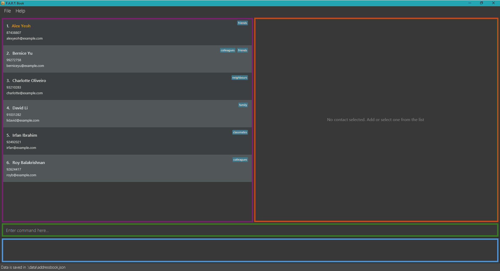
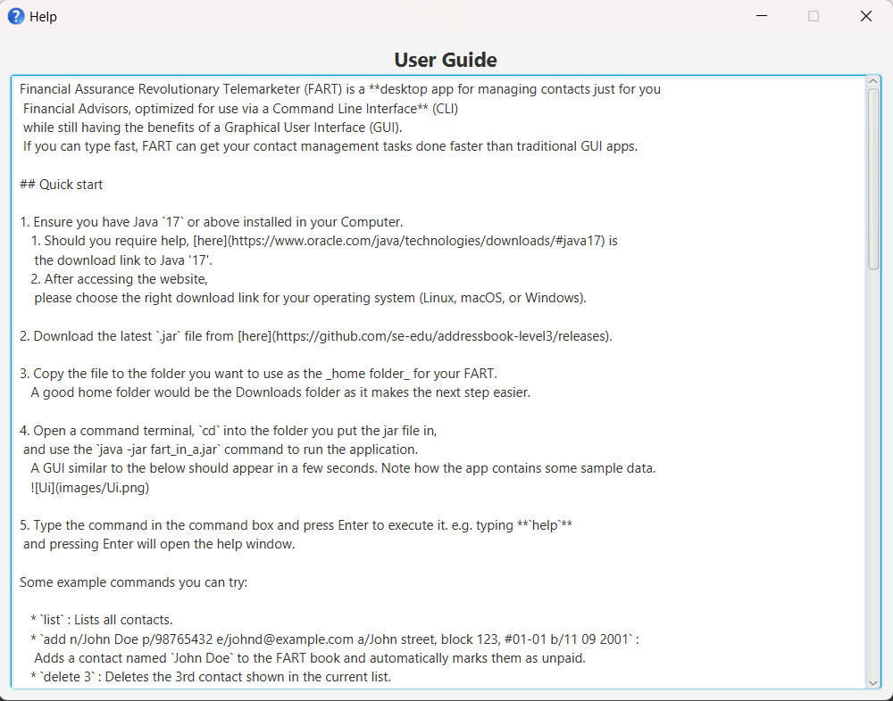
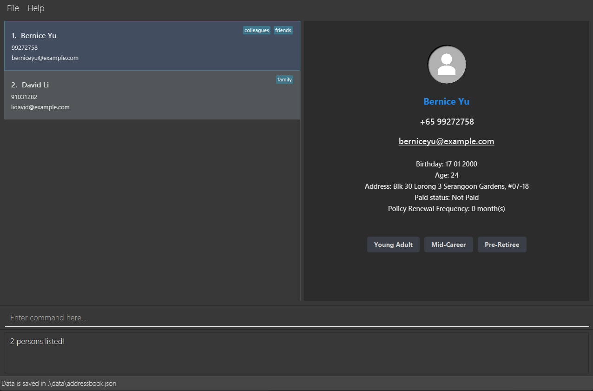

Financial Assurance Revolutionary Telemarketer (FART) is a **desktop app for managing contacts just for you Financial Advisors, optimized for use via a Command Line Interface** (CLI) while still having the benefits of a Graphical User Interface (GUI). If you can type fast, FART can get your contact management tasks done faster than traditional GUI apps.

* Table of Contents
{:toc}

--------------------------------------------------------------------------------------------------------------------

## Quick start

1. Ensure you have Java `17` or above installed in your Computer.
    1. You can check which version of Java you are currently running by entering `java -version` into a command terminal.
    2. Should you require help, [here](https://www.oracle.com/java/technologies/downloads/#java17) is the download link to Java '17'
    3. After accessing the website, please choose the right download link for your operating system (Linux, macOS or Windows)

2. Download the latest `.jar` file from [here](https://github.com/se-edu/addressbook-level3/releases).

3. Copy the file to the folder you want to use as the _home folder_ for your FART.
   1. A good home folder would be the Downloads folder as it makes the next step easier.

4. Open a command terminal, `cd` into the folder you put the jar file in, and use the `java -jar fart_in_a.jar` command to run the application. 
   A GUI similar to the below should appear in a few seconds. Note how the app contains some sample data. 
   
   1. To open the command terminal, do open the terminal app for Linux/macOS users, and Windows Powershell for Windows users.
   2. For most users, in the terminal window please type `cd Downloads` to change the current folder to Downloads
   3. Alternatively, you may navigate to the folder using File Explorer, then right click it and select **Open in Terminal**

5. Type the command in the command box and press Enter to execute it. e.g. typing **`help`** and pressing Enter will open the help window. 
   Some example commands you can try:

   * `list` : Lists all contacts.
   
   * `help` : Opens the Help window containing all valid commands and their respective formats

   * `add n/John Doe p/98765432 e/johnd@example.com a/John street, block 123, #01-01 b/11 09 2001` : Adds a contact named `John Doe` to the FART book and automatically marks them as unpaid.

   * `delete 3` : Deletes the 3rd contact shown in the current list.

   * `paid 3` : Marks the 3rd contact shown in the current list as paid.

   * `clear` : Deletes all contacts.

   * `find john`  : Displays all contacts with keyword(s) matching "john"
   
   * `find 9123`  : Displays all contacts with phone number(s) containing "9123" 
   
   * `find serangoon` : Displays all contacts with keyword(s) matching "serangoon" 

   * `exit` : Exits the app.

6. Refer to the [Features](#features) below for details of each command.

--------------------------------------------------------------------------------------------------------------------

## Features

**:information_source: Notes about the command format:** 

* Words in `UPPER_CASE` are the parameters to be supplied by the user. 
  e.g. in `add n/NAME`, `NAME` is a parameter which can be used as `add n/John Doe`.

* Items in square brackets are optional. 
  e.g `n/NAME [t/TAG]` can be used as `n/John Doe t/friend` or as `n/John Doe`.

* Items with `…`​ after them can be used multiple times including zero times. 
  e.g. `[t/TAG]…​` can be used as ` ` (i.e. 0 times), `t/friend`, `t/friend t/family` etc.

* Parameters can be in any order. 
  e.g. if the command specifies `n/NAME p/PHONE_NUMBER`, `p/PHONE_NUMBER n/NAME` is also acceptable.

* Extraneous parameters for commands that do not take in parameters (such as `help`, `list`, `exit` and `clear`) will be ignored. 
  e.g. if the command specifies `help 123`, it will be interpreted as `help`.
* If the command specifies an index after the command word, e.g. `paid 3`, the index must be **valid**  
  i.e. the index must be visible in the contact list

* If you are using a PDF version of this document, be careful when copying and pasting commands that span multiple lines as space characters surrounding line-breaks may be omitted when copied over to the application.

### Viewing help : `help`

Shows a message explaining the various commands and their formats.

Format: `help`

### Adding a person: `add`

Adds a person to the FART book.

Format: `add n/NAME p/PHONE_NUMBER e/EMAIL a/ADDRESS b/BIRTHDAY [t/TAG]…​`

:bulb: **Tip:**
A person can have any number of tags (including 0)

Examples:
* `add n/John Doe p/98765432 e/johnd@example.com a/John street, block 123, #01-01 b/11 09 2001`
* `add n/Betsy Crowe t/friend e/betsycrowe@example.com a/Newgate Prison p/91234567 b/11 09 2001 t/criminal`

**Note:** As of version 1.3, only valid email addresses and Singapore phone numbers are accepted. 
Birthdays should be added in DD MM YYYY format.

### Listing all persons : `list`

Shows a list of all persons in the FART book. The list is displayed in chronological order (i.e., the order you added the contacts in).

Format: `list`

### Editing a person : `edit`

Edits an existing person in the FART book.

Format: `edit INDEX [n/NAME] [p/PHONE] [e/EMAIL] [a/ADDRESS] [b/BIRTHDAY] [t/TAG]…​`

* Edits the person at the specified `INDEX`. The index refers to the index number shown in the displayed person list. The index **must be a positive integer** 1, 2, 3, …​
* At least one of the optional fields must be provided.
* Existing values will be updated to the input values.
* When editing tags, the existing tags of the person will be removed i.e adding of tags is not cumulative.
* You can remove all the person’s tags by typing `t/` without
    specifying any tags after it.

Examples:
*  `edit 1 p/91234567 e/johndoe@example.com` Edits the phone number and email address of the 1st person to be `91234567` and `johndoe@example.com` respectively.
*  `edit 2 n/Betsy Crower t/` Edits the name of the 2nd person to be `Betsy Crower` and clears all existing tags.

### Locating persons by attribute: `find`

Finds persons whose attributes contain any of the given keywords.

Format: `find KEYWORD [MORE_KEYWORDS]`

* The search is case-insensitive. e.g `hans` will match `Hans`
* Keywords are matched against Name, Phone, Address, Email, Birthday, Tag
* The order of the keywords does not matter. e.g. `Hans Bo` will match `Bo Hans`
* Persons matching at least one keyword will be returned (i.e. `OR` search).
  e.g. `Hans Bo` will return `Hans Gruber`, `Bo Yang`
* Partial matches of a keyword will also be returned. e.g. ``9123`` will return person
with the phone number ``91234567``

Examples:
* `find John` returns `john` and `John Doe`
* `find alex david` returns `Alex Yeoh`, `David Li` 
  
* `find serangoon` returns ``Bernice Yu``, ``David Li``

### Deleting a person : `delete`

Deletes the specified person from the FART book.

Format: `delete INDEX`

* Deletes the person at the specified `INDEX`.
* The index refers to the index number shown in the displayed person list.
* The index **must be a positive integer** 1, 2, 3, … and cannot be larger than the length of the list.​

Examples:
* `list` followed by `delete 2` deletes the 2nd person in the FART book.
* `find Betsy` followed by `delete 1` deletes the 1st person in the results of the `find` command.

**Note:** As a `delete` command cannot be undone, the FART Book will first prompt you to confirm that the
 contact that you want to delete is correct. If you select `Cancel`, the deletion will be aborted.
### Clearing all entries : `clear`

Clears all entries from the FART book. 

**Note:** This action cannot be undone.

Format: `clear`

### Marking a person as paid: `paid`

Marks the specified person from the FART book as paid.

Format: `paid INDEX`

* Marks the person at the specified `INDEX` as paid.
* The index refers to the index number shown in the displayed person list.
* The index **must be a positive integer** 1, 2, 3, … and cannot be larger than the length of the list.​

Examples:
* `list` followed by `paid 2` marks the 2nd person in the FART book as paid.
* `find Betsy` followed by `paid 1` marks the 1st person in the results of the `find` command as paid.

### Marking a person as unpaid: `unpaid`

Marks the specified person from the FART book as unpaid.

Format: `unpaid INDEX`

* Marks the person at the specified `INDEX` as unpaid.
* The index refers to the index number shown in the displayed person list.
* The index **must be a positive integer** 1, 2, 3, … and cannot be larger than the length of the list.​

Examples:
* `list` followed by `unpaid 2` marks the 2nd person in the FART book as unpaid.
* `find Betsy` followed by `unpaid 1` marks the 1st person in the results of the `find` command as unpaid.

### Viewing a Contact's Details
* **Double-click** on a contact in the contact list to bring up a more detailed view of the person, including information like address and birthday on the right window.
* You may resize this window to your own convenience. 
* If the contact list is empty, a placeholder prompting you to add a contact will be displayed instead.
* **Note:** The displayed contact will persist and edits will not be reflected until you select another contact or close the FART book.

### Exiting the program : `exit`

Exits the program.

Format: `exit`

### Saving the data

FART data are saved in the hard disk automatically after any command that changes the data. There is no need to save manually.
The location of where the data is stored is specified at the bottom status bar of the app.

### Editing the data file

FART data are saved automatically as a JSON file `[JAR file location]/data/addressbook.json`. Advanced users are welcome to update data directly by editing that data file.

:exclamation: **Caution:**
If your changes to the data file makes its format invalid, FART will discard all data and start with an empty data file at the next run. Hence, it is recommended to take a backup of the file before editing it. 
Furthermore, certain edits can cause the FART to behave in unexpected ways (e.g., if a value entered is outside of the acceptable range). Therefore, edit the data file only if you are confident that you can update it correctly.

### Archiving data files `[coming in v2.0]`

_Details coming soon ..._

--------------------------------------------------------------------------------------------------------------------

## FAQ

**Q**: How do I transfer my data to another Computer? 
**A**: Install the app in the other computer and overwrite the empty data file it creates with the file that contains the data of your previous FART home folder.

--------------------------------------------------------------------------------------------------------------------

## Known issues

1. **When using multiple screens**, if you move the application to a secondary screen, and later switch to using only the primary screen, the GUI will open off-screen. The remedy is to delete the `preferences.json` file created by the application before running the application again.
2. **If you minimize the Help Window** and then run the `help` command (or use the `Help` menu, or the keyboard shortcut `F1`) again, the original Help Window will remain minimized, and no new Help Window will appear. The remedy is to manually restore the minimized Help Window.

--------------------------------------------------------------------------------------------------------------------

## Command summary

Action | Format, Examples
--------|------------------
**Add** | `add n/NAME p/PHONE_NUMBER e/EMAIL a/ADDRESS b/BIRTHDAY [t/TAG]…​`   e.g., `add n/James Ho p/22224444 e/jamesho@example.com a/123, Clementi Rd, 1234665 b/11 09 2001 t/friend t/colleague`
**Clear** | `clear`
**Delete** | `delete INDEX`  e.g., `delete 3`
**Edit** | `edit INDEX [n/NAME] [p/PHONE_NUMBER] [e/EMAIL] [a/ADDRESS] [t/TAG]…​`  e.g.,`edit 2 n/James Lee e/jameslee@example.com`
**Find** | `find KEYWORD [MORE_KEYWORDS]`  e.g., `find James Jake`
**List** | `list`
**Help** | `help`
**Paid** | `paid INDEX`  e.g., `paid 3`
**Unpaid** | `unpaid INDEX`  e.g., `unpaid 3`
